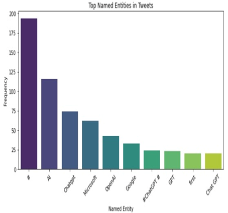
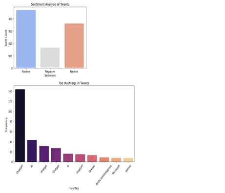

# Sentiment Analysis and Trend Detection on Twitter Using NLP

This project applies Natural Language Processing (NLP) techniques to analyze sentiments and detect trends from Twitter data. It involves collecting tweets, performing sentiment analysis, and identifying trending topics based on tweet frequency and user interactions.

## Project Overview

This project performs the following tasks:

- **Sentiment Classification**: Classifies tweets into positive, negative, or neutral categories.
- **Trend Detection**: Identifies trending topics by analyzing the frequency of keywords in the tweets.
- **Visualization**: Displays sentiment trends over time and visualizes the sentiment distribution.

## Dataset

- **Source**: Kaggle
- **Size**: 80 KB
- **Attributes**:
  - Tweet ID
  - Timestamp
  - Username
  - Tweet Text
  - Hashtags
  - Retweet Count
  - Like Count

## Expected Output

- **Sentiment Classification**: Each tweet will be classified as positive, negative, or neutral.
- **Sentiment Trend Visualization**: A graphical representation of sentiment trends over time.
- **Trending Topics**: Detection of popular topics based on tweet keywords and frequencies.

## Code Example

```python
import pandas as pd
from textblob import TextBlob
import matplotlib.pyplot as plt

# Load dataset
df = pd.read_csv("tweets.csv")

# Sentiment Analysis Function
def get_sentiment(text):
    analysis = TextBlob(text)
    return "Positive" if analysis.sentiment.polarity > 0 else "Negative" if analysis.sentiment.polarity < 0 else "Neutral"

df['Sentiment'] = df['Tweet Text'].apply(get_sentiment)

# Plot sentiment distribution
df['Sentiment'].value_counts().plot(kind='bar', color=['green', 'red', 'blue'])
plt.title("Sentiment Analysis of Tweets")
plt.xlabel("Sentiment")
plt.ylabel("Count")
plt.show()
```

## Instructions

To successfully run the **Sentiment Analysis and Trend Detection on Twitter Using NLP** project, follow these steps:

---

## **Steps to Run the Project**

### 1. **Clone the Repository**
   If you haven't already cloned the project from GitHub, do so with:
   ```bash
   git clone https://github.com/Yash-Raj-96/sentiment_trend_analysis.git
   cd sentiment_trend_analysis
   ```

---

### 2. **Install the Necessary Libraries**
   Ensure you have Python installed, then install the required libraries using:
   ```bash
   pip install pandas textblob matplotlib
   ```
   If additional dependencies are needed, install them with:
   ```bash
   pip install -r requirements.txt
   ```

---

### 3. **Prepare the Dataset**
   - Ensure the dataset (`tweets.csv`) is present in the project folder.
   - If collecting real-time data, modify the script to fetch tweets via the Twitter API.

---

### 4. **Run the Python Script**
   Execute the sentiment analysis script:
   ```bash
   python sentiment_trend.py
   ```

---

### 5. **View the Output**
   - Sentiment classification will be displayed in the terminal.
   - A bar chart visualizing sentiment distribution will be generated.

---

### 6. **Analyze the Trends**
   - Modify the script to detect trending topics using word frequencies.
   - Extend functionality to plot trends over time.

---

## Screenshots

### Fig 1.1: Sentiment Analysis




## Conclusion

This project demonstrates how NLP can be used to analyze and visualize Twitter data, offering valuable insights into public sentiment and trending topics.

---

### License

This project is licensed under the MIT License - see the [LICENSE](LICENSE) file for details.
```
